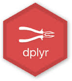

```{r setup, include=FALSE}
knitr::opts_chunk$set(echo = TRUE)

```


Processing Analytical Data with R {data-navmenu="PyCon Limerick"}
=====================================

Column 
--------------------

### Introduction

<p>

<div>
<center>

</center>
</div>

<p>

<h4>Contents</h4>
<p>
* Date: Saturday 29th February 2020
* Location: Strand Hotel Limerick 
* Times: 10.00am to 17:10pm approx


About {data-navmenu="PyCon Limerick"}
==============================================================

Column
-------------------------------------------------------------

### Pycon Limerick 2020

PyCon Limerick 2020 will be returing to Limerick on Saturday 29th February 2020.
This one day conference is a mixture of talks and workshops on topics related to the Python Programming Language.

Python Ireland is the Irish organization representing the various chapters of Python users. 
One of our key activities is the organization of Python Conferences. We have organized PyCon Ireland in Dublin over the last ten years.


We expect to present talks pertaining to

* Data Science and Machine Learning
* Big Data and Data Engineering
* Software Engineering and Development Operations
* Web Frameworks (i.e. Django)
* IOT, Sensors and Micropython
* Applications for Natural Sciences (e.g. Earth Observation, Environmental Monitoring)


Code of Conduct {data-navmenu="PyCon Limerick"}
==================================

Column
-----------------------------

### Code of Conduct

PyCon Limerick is dedicated to providing a harassment-free and inclusive conference experience for all in attendance regardless of, but not limited to, gender, sexual orientation, disabilities, physical attributes, age, ethnicity, social standing, religion or political affiliation.

We do not tolerate harassment of participants (including organisers and vendors) in any form. Sexual innuendos and imagery are not appropriate for any conference venue, including presentations.

Anyone violating these rules may be given warning or expelled from the conference (without a refund) at the discretion of the conference organisers.

Our code of conduct/anti-harassment policy can be found here.


Working with Text {data-navmenu="Applications"}
====================================

Column
-------------------------------------------------------------

### Morning Session 1

| Time   |  Room   |  Talk Title    |
|:-------|:-------|:------------------------------------------------------------|
| 10:00-10:45 | Room 1 |   **Arjumand Younus** (UCD / WiMLDS Dublin) <br> Python for Social Good |	
| 10:00-10:45 | Room 2 |   **Johannes Ahlessman** <br> Python stream processing using Python, Kafka and Faust |
| 10:00-10:45 | Room 3 |   **Laurent Picard**  <br> Building smarter solutions with no expertise in machine learning |
| | | |
| 11:20-11:45 | | ***Coffee Break*** |


 	  	


Working with Time and Dates {data-navmenu="Applications"}
====================================
Column
-------------------------------


### Schedule

| Time   |  Room   |  Talk Title    |
|:-------|:-------|:------------------------------------------------------------|
|11:45-12:15 | Room 1	| **Dermot Canniffe** <br> Bias Engineering  |	
|11:45-12:15 | Room 2 |   | 
|11:45-12:15 | Room 3 | **Chidubem Iddianozie** <br> Discriminative Machine Learning models for semantifying IoT data: Why, How and Lessons Learnt.	| 
| | | ***(Pause)***|
|12:20-13.05 | Room 1| **Cheuk-Ho Ting** (PyData London) <br> Are you supporting the right politician? - Graph Visualization of Voting Data	|
|12:20-13.05 | Room 2| **Stephen Finucane** (Red Hat) <br> Getting started with Sphinx and Docutils 	|
|12:20-13.05 | Room 3| **Allyn Hunt** <br> Adding data visualisation to your Flask app with React Victory charts |
| | | |
| 11:20-11:45 | | ***Lunch Break*** |


Working with Databases {data-navmenu="Applications"}
====================================

Column
----------------------------------------------

### Schedule

| Time   |  Room   |  Talk Title    |
|:-------|:-------|:------------------------------------------------------------|
|14.15 - 14:45| Room 1 | **Miguel Grinberg** <br> I Want To Know What You Did Last Summer (engaging with the Python Community)	|	 
|14.15 - 14:45| Room 2 | **James Nagle** (Kerry Data Science) <br> Social Network of 1916 Rising |	
|14.15 - 14:45| Room 3 |  **Olga Lyashevska** (GMIT) <br> Class imbalance in gradient boosting classification algorithms: application to experimental stroke data|	 
|  |  |   |
|15.20-15.45 | | Coffee Break | 


Working with R Objects {data-navmenu="Applications"}
====================================

Column
----------------------------------------------

### Schedule

| Time   |  Room   |  Talk Title    |
|:-------|:-------|:------------------------------------------------------------|
|15:45 - 16.15 | Room 1 | **Matteo Perrico** <br> Customer churn prediction and segmentation techniques	|	
|15:45 - 16.15 | Room 2 | **Meghana Rathi** (UCD) <br> Playing Pong with AI	|	
|15:45 - 16.15 | Room 3 | **Jaime Buelta** (Rapid Ratings)	<br> Emotional demands of software development|	
| | | (Pause) | 
| 16.20 - 17.05 | Room 1 | **Tania Allard**  (Microsoft) <br> Reproducible data science and scientific computing: how the open source ecosystem can help|
| 16.20 - 17.05 | Room 2 | 	 **Kartik Sharma**	<br> ELK Stack with Python for Effective Logging|
| 16.20 - 17.05 | Room 3 | **Domas Zelionis** <br> Flask-AppBuilder + Customization |


Abstracts for Morning Session 1 {data-navmenu="Applications"}
=====================================


Column {.tabset}
-------------------------------------------------

Abstracts for Morning Session 1

### Room 1

<h5>GraphQL with Python </h5>


* The talk will be about GraphQL technology. What is GraphQL and why we might use it. 
* What are the advantages and disadvantages of using GraphQL. 
* I will talk about the main concepts in GraphQL like schemas, types, queries, mutations, and subscriptions.
* I will show how to implement GraphQL with python using an example with Graphene and Django. 
* I will have a demo with a sample app build in Django that will serve as a GraphQL API.


### Room 2


<h5> Social Network Analysis of the 1916 rising (James Nagle)</h5>

In 2015 the National Archives released files which had been compiled by the Dublin Metropolitan Police 100 years beforehand. From June 1915 to April 1916 they followed members of groups such as Sinn F?in, the Irish Volunteers and the Gaelic League and reported on who they were seen talking to. Using these files, the python library networkX and the open source network analysis package Gephi, I was able to build a social network of the interactions recorded.

The resulting network supports well known facts about the planning around the 1916 Rising but also presents interesting questions surrounding figures who are rarely mentioned in Irish history but feature prominently in the network. During the reporting on these files at the time of their release these figures were overlooked as their importance could not be seen by a cursory glance. The network can also be used to understand what type of information the D.M.P. had in relation to the separatist movement and judge the effectiveness of their intelligence gathering.

This talk would serve as an introduction to social network analysis in python and the use of the networkX library and Gephi. If there is already a talk on this area I could discuss the use of data science in the study of Irish history. I have also applied natural language processing to the Anglo Irish Treaty debates and am currently looking at how python can be used to analyse the police books containing all arrests made by the DMP from 1905-1918.

All these projects focus on taking large, inaccessible data sets, presenting and visualising them in interesting and informative ways and extracting valuable findings from them. Some findings and visualisations of the 1916 network can be found here: http://www.anquantarbuile.com/social-network-of-the-1916-rising and the Anglo Irish Treaty debate project can be found here: http://www.anquantarbuile.com/treaty-debates

### Room 3

<h5>Building smarter solutions with no expertise in machine learning (Laurent Picard)</h5>


* ML? API? AutoML? Python is the language of choice to solve problems with machine learning, but what can we build in only a few hours or days and without any expertise? 

* In this session, we'll see how to benefit from existing ML models and how to create a custom model with AutoML techniques. 

* We'll also be active players of a live demo, so don't put your smartphone on airplane mode!

<h5> Class imbalance in gradient boosting classification algorithms (Olga Lyashenka) </h5>
Class imbalance in gradient boosting classification algorithms: application to experimental stroke data


Working with PDF documents {data-navmenu="Working with Documents"}
=====================================

Column {.tabset}
-------------------------------------------------


### {pdftools}

<h5> Working with PDF Documents </h5>

Bias Engineering is the tendency of people to engineer their own implicit biases into the products they create. And it could also be the effort to reduce these implicit biases in developed products.

I had been looking in particular at the Dunning-Kruger effect and how it pertains to software development.

<p>

### {staplr}

<h3>The Staplr R package </h3>

<h5> Conference Events in the West of Ireland</h5>

Informal talk on building a tech community in West of Ireland

### {doconv}


One of the great advantages of both tools is their inherent customisability and extensibility: not only can you customise the output of the tools, be that HTML, LaTeX or something else, but you can also write extensions that allow you to do things up to and including automatically generating documentation for you.

#### Installation

### Room 3

<hline>
<h5> Discriminative Machine Learning models for semantifying IoT data (Chidubem Iddianozie) </h5>

Discriminative Machine Learning models for semantifying IoT data: Why, How and Lessons Learnt.

This talk will focus on adding data visualization to Flask applications by using the amazing React Victory library.
Presenting data in web applications can be a daunting task, web applications make it very easy to store large amounts of data into your database of choice but many applications struggle with finding a way to display this data in a meaningful way. Server side rendering of charts can work but often lead to a slower and poor user experience.
This talk proposes a solution by integrating a React frontend onto your Flask application, and taking advantage of the powerful and flexible React Victory library for data charting and visualization.


<p>

Working with Maps {data-navmenu="Applications"}
=====================================

Column {.tabset}
-------------------------------------------------

Abstracts for Afternoon Session 1

### Room 1

<h5> I Want To Know What You Did Last Summer (Miguel Grinberg) </h5> 
We all love to learn about the cool things others make, but we tend to think those who write or talk publicly about their projects are rare and specially gifted individuals, while in fact they are normal people just like you and I. 
<hline>

<h5> High-Level APIs for Machine Learning (Iain Keaney) </h5>

* An introduction to the python high-level APIs for machine learning, that allow coders to get started on building and deploying models much quicker without knowing the mathematics behind machine learning. 
* May also discuss deployment in both cloud and/or edge.

### Room 2


<hline>
<h5> Writing Good Python Code (Prashant Chaubey)</h5>

We love python because of its readability, massive ecosystem, vibrant community etc. and the list goes on. However, like other programming languages, it is easy to write cryptic, unmaintainable, and rigid python code. In short an ugly code(I can give an example). Moreover in teams, this problem escalates as different developers have diverse code styles. How to ensure code quality and homogeneity? PEP 8 is a style guide of python code.


### Room 3

<h5>Python for Social Good (Arjumand Younus)</h5>

As a data scientist, I am into making meaning from data and Python is the main tool for it.

However does this meaning translate into impact; and how can we come up with projects that provide huge societal impact.

I will delve into some example projects of my own while also giving examples of how Python helped with quick analysis.

This talk will be different from your traditional Python talks because of the interactive nature while we try to think of "Data Science for Social Good" projects.
<p>
<hline>


Abstracts for Afternoon Session 2 {data-navmenu="Applications"}
=====================================

Column {.tabset}
-------------------------------------------------

Abstracts for Afternoon Session 2

### Room 1

<h5>Customer churn prediction and segmentation techniques	(Matteo Perrico)</h5>

My project tries to address a common problem in the field of supermarkets and retail: customer churn.

The work provides some ideas and developments to deal with this problem effectively.  The project was conducted on four supermarkets in Italy, considering the sales figures for 2018.

The work is developed in two main parts:

* the first part analyzes some customer segmentation techniques present in the literature, with the aim of developing a customized model to identify the customer churn. 

* The second part is the concrete application of the model of created, analysis of results and implementation of some predictive models to apply customer loyalty techniques.

The developed model is the result of some customizations of the basic RFM model. 

The goal is to interpret the behavior of customers, trying toindentify the significant changes over time.


<h5> Reproducible data science and scientific computing (Tania Allard) </h5>
Reproducible data science and scientific computing: how the open source ecosystem can help


### Room 2

<h5> Playing Pong with AI	(Meghana Rathi) </h5>


My project was based on using reinforcement learning specifically Q-learning and model predictive control to develop an agent that can play the atari game of PONG. 


### Room 3


<h5> Emotional demands of software development	(Jaime Buelta) </h5>

* A not talked too much part of being software developer is to handle the emotional and psychological demands of the work. 
* The pressure is high, and imposter syndrome cramps up. 
* In this talk we will talk about difficulties in handling the work and learn how to handle our emotions and fears is an important ability in a long career.	


<h5>Build a customizable Flask application (Domas Zelionis)</h5>

The talk will feature:

* A live coding demonstration of the project setup.

* Enable authentication, including user roles and privileges.
* Overview of setting up your MongoDB and database connections.
* Customization and styling for your project.
<p>


Workshops {data-navmenu="Workshops"}
==================================

Column {.tabset}
-----------------------------

### Workshop 1 (Morning)

<pre><code>
ggsave(filename = "Milk_MCS.png", Milk_MCS,      
	width = 10, height = 8, dpi = 300, 
	units = "in", device='png')
</code></pre>

### Workshop 2 (Morning)

<h5>  Machine learning and high-performance computing with PyCall </h5>

* Presenter: Paul Palmes (IBM Dublin)
* Taking place in De Lacey Room  - Venue Capacity : Approx 10

### Workshop 3 (Afternoon)

<h5> A Python ROS framework to build your own robots from </h5>

* Presenter: John O'Reilly
* Taking place in Henehan Suite - Venue Capacity is Approx 30

Lunch {data-navmenu="Preparation"}
====================================

### Lunch 


<h5> Where to go for Lunch</h5>
There are several wonderful places to have lunch in walking distance of the venue.
<p>
* [Milanos](http://milano.ie/our-restaurants/restaurant-details/Milano-Limerick) on Honan's Quay - On the riverfront facing the hotel, with lots of room.
* [The Hunt Museum Cafe](https://www.huntmuseum.com/cafe/)


Tidyverse R package {data-navmenu="Preparation"}
==================================

Column{.tabset}
-----------------------------

### {dplyr}


<p>

<div>
<center>

</center>
</div>

<p>

### {tidyr}


TidyR
